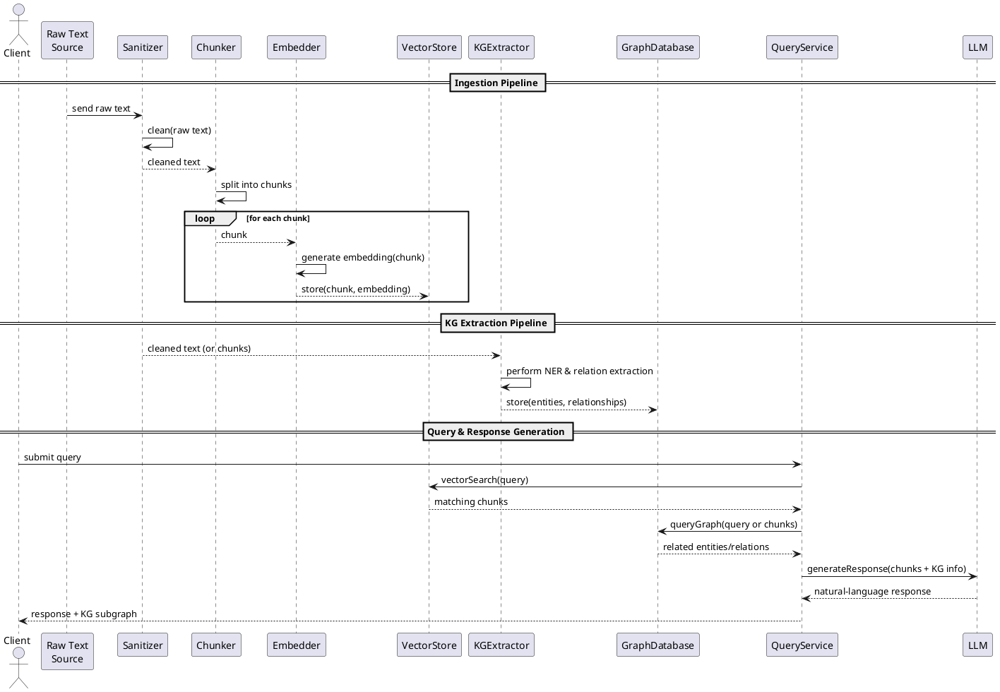

# KG + RAG

## References

- [Apache OpenNLP](https://opennlp.sourceforge.net/models-1.5/)

## Plan

### Ingestion Pipeline
1. Read raw text
2. Sanitize raw text
3. Chunk cleaned text
4. Generate embeddings for text chunks
5. Store chunks and embeddings in a vector store

### KG Extraction Pipeline
1. Process the cleaned text (or chunks) to extract entities (NER) and relationships
2. Store entities and relationships in a graph database

### Querying and Response Generation
1. Performing a vector search on the text chunks
2. Optionally, querying the knowledge graph for related information based on the query or retrieved chunks
3. Combined retrieved text chunks and KG info as context for LLM.
4. Use the LLM to generate a natural language response based on the provided context.
5. Presenting retrieved KG relationship or subgraph as response.


## Targeted relationships
person influenced by person
concept contrasts with concept
work discusses concept
person argues that idea/concept
concept is a manifestation of principle
work is an example of artistic form

## Setup

```shell
docker compose --profile ollama --profile dev -f ./docker/docker-compose.yml up
```

## Diagrams

